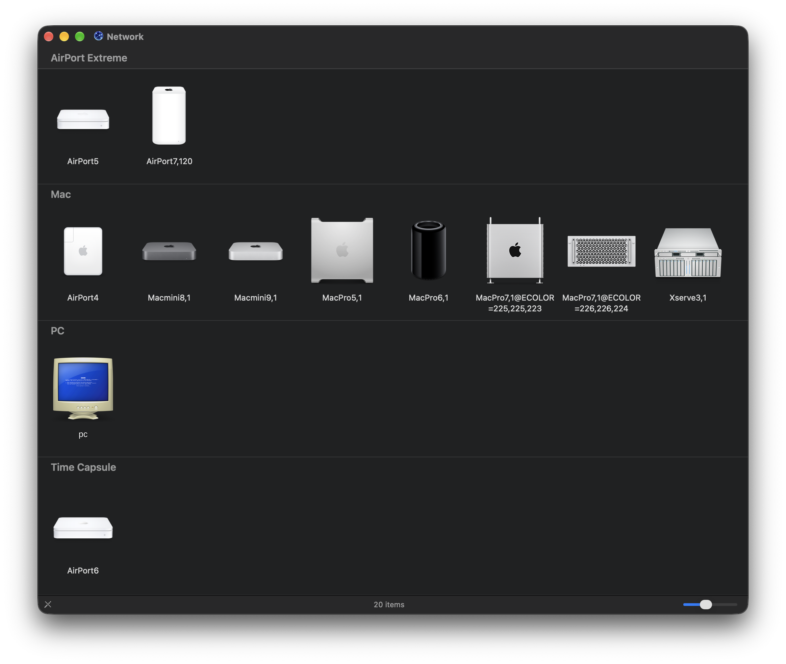
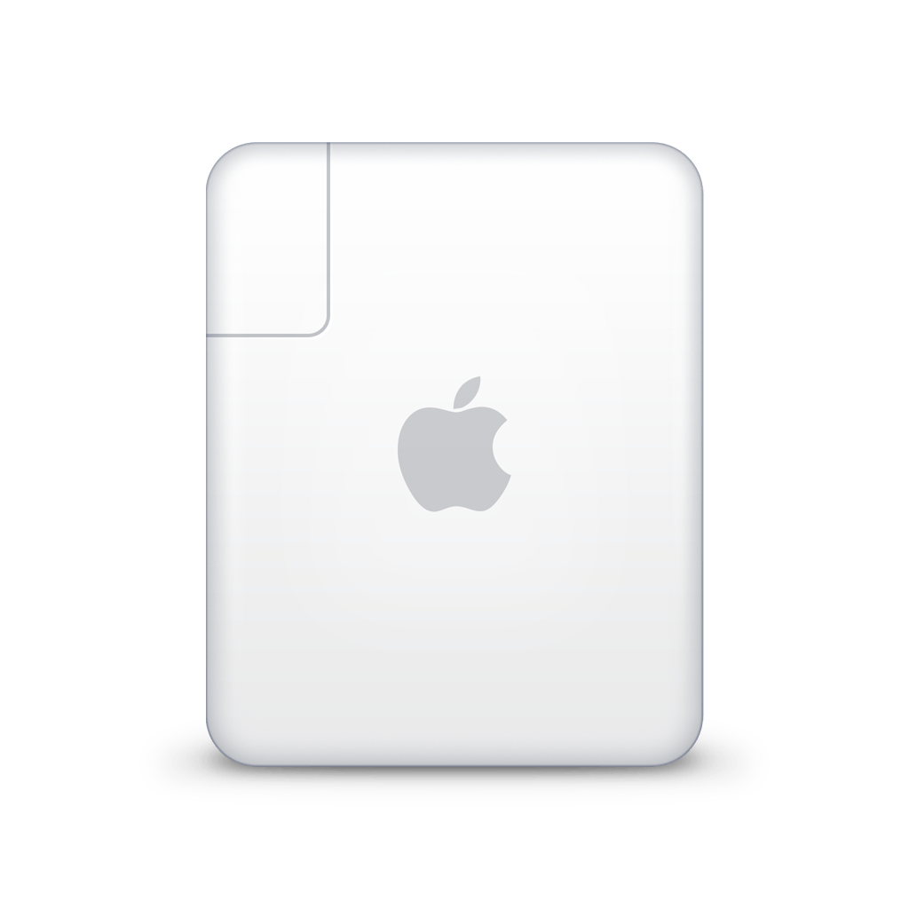
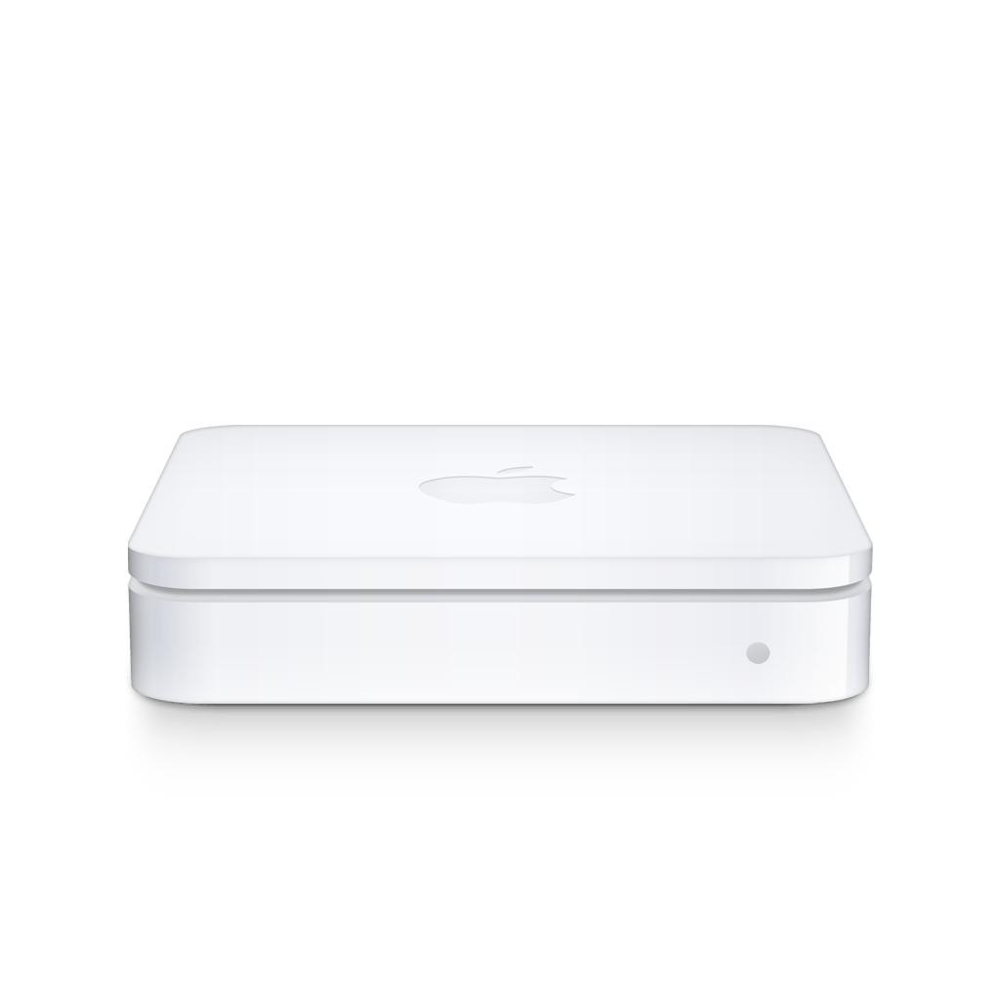
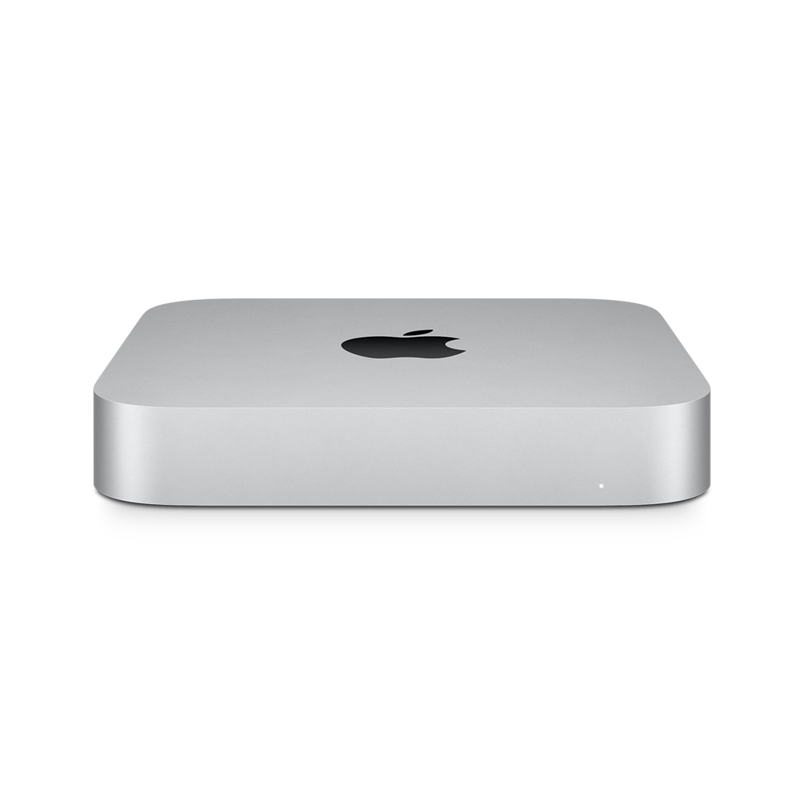

# device-icons

Finder draws a network device with the icon of the Apple device its `_device-info._tcp` record names: `model=MacPro7,1`
gives the 2019 Mac Pro tower. Two commands work with that:

- [`dump`](#dump) writes every icon macOS knows for such a model identifier, grouped so one can be picked by eye in
  Finder.
- [`preview`](#preview) shows a model identifier in Finder's Network view without owning the device.

macOS only: the icons live in `CoreTypes.bundle`, and `iconutil`, `osascript`, `open`, and `dns-sd` do the work no
Python module does. Needs [uv](https://docs.astral.sh/uv/); the runtime is the standard library.



<!--
docs/network-view.png: Finder's Network view with the eleven devices of the table below announced by

    uv run device-icons preview --no-open AirPort4 AirPort5 AirPort6 AirPort7,120 Macmini8,1 Macmini9,1 \
      MacPro6,1 MacPro5,1 MacPro7,1@ECOLOR=225,225,223 MacPro7,1@ECOLOR=226,226,224 Xserve3,1

Icon view grouped by Kind, toolbar and sidebar hidden, captured with shift-command-4 on a Retina display, then the
hosts of the home network edited out with ChatGPT Astra, one of them kept as the PC.
-->

## Dump

| Model identifier | `AirPort4` | `AirPort5` | `AirPort7,120` | `Macmini8,1` | `Macmini9,1` | `MacPro5,1` | `MacPro6,1` | `AirPort6` | `Xserve3,1` | `MacPro7,1`<br/>`@ECOLOR=`<br/>`225,225,223` | `MacPro7,1`<br/>`@ECOLOR=`<br/>`226,226,224` |
| --- | :-: | :-: | :-: | :-: | :-: | :-: | :-: | :-: | :-: | :-: | :-: |
| Type identifier | `com.apple.airport-express` | `com.apple.airport` | `com.apple.airport-extreme-tower` | `com.apple.macmini-2018` | `com.apple.macmini-2020` | `com.apple.macpro-firewire` | `com.apple.macpro-cylinder` | `com.apple.time-capsule` | `com.apple.xserve-xeon` | `com.apple.macpro-2019` | `com.apple.macpro-2019-rackmount` |
| Kind | Mac | AirPort Extreme | AirPort Extreme | Mac | Mac | Mac | Mac | Time Capsule | Mac | Mac | Mac |
| Icon |  |  |  |  |  |  |  |  |  |  |  |
| Sidebar icon |  |  |  |  |  |  |  |  |  |  |  |

<!--
The table above is docs/icons/README.md, made with

    uv run device-icons dump --horizontal --no-open \
      --model AirPort4 --model AirPort5 --model AirPort6 --model AirPort7,120 \
      --model Macmini8,1 --model Macmini9,1 --model MacPro6,1 --model MacPro5,1 \
      --model MacPro7,1@ECOLOR=225,225,223 --model MacPro7,1@ECOLOR=226,226,224 \
      --model Xserve3,1 \
      docs/icons

then pngquant --ext .png --force docs/icons/icons/*.png to keep the repository small, and the image paths
prefixed with docs/icons/ since this file sits at the repository root.
-->

A device that announces itself over Bonjour, a Raspberry Pi say, can wear any icon macOS has for an Apple device. To
pick one, dump them all:

```bash
uv run device-icons dump
```

The dump lands in `out/`, which opens in Finder. Its `by-sidebar/` holds one folder per sidebar icon, each wearing that
icon; inside are the icons that come with it. Having picked one, `index.json` lists the model identifiers that produce
it, and any of them, announced as `model=…`, makes Finder draw it. `README.md` holds the same as a table to scroll
through, one row per model identifier with its type identifier, kind, icon, and sidebar icon, grouped by sidebar icon
and sorted by model identifier within; GitHub renders it when the dump is browsed there:

```json
{
  "sidebars": {
    "SidebarXserve": {
      "sidebar_icon": "sidebar/SidebarXserve.png",
      "icons": {
        "com.apple.xserve": {
          "icon": "icons/com.apple.xserve.png",
          "type_identifiers": ["com.apple.xserve", "com.apple.xserve-xeon", "com.apple.mac.rackmount"],
          "model_identifiers": ["RackMac", "RackMac1,1", "Xserve", "Xserve3,1"]
        }
      }
    }
  },
  "dropped": {
    "no type": ["AppleDisplay18,2", "AppleDisplay2,1"],
    "no icon": [],
    "no sidebar icon": ["AirPods1,1", "AppleTV1,1", "Watch8,2"]
  }
}
```

Another directory:

```bash
uv run device-icons dump ~/Desktop/device-icons
```

It is emptied first, but only when it is missing, empty, or holds an earlier dump. A `README.md` counts as an earlier
dump's only when it starts with the dump's first sentence; any other stops `dump`.

Only some model identifiers, a project's devices say, and without Finder:

```bash
uv run device-icons dump --no-open --model MacPro7,1 --model Xserve3,1 docs/icons
```

`--model` restricts the dump to the given model identifiers and the types they resolve to. One that is not declared,
or resolves to no type, or whose type has no icon or no sidebar icon, ends `dump` before anything is written, with a
message naming it and what is missing.

Or whole types:

```bash
uv run device-icons dump --no-open --type com.apple.macpro-2019 --type com.apple.xserve-xeon docs/icons
```

`--type` restricts the dump to the given type identifiers and the model identifiers that resolve to them, and refuses
the same way. `--type` and `--model` exclude each other; the layout stays the same for both. `--no-open` skips opening
the output directory in Finder.

For the few model identifiers of a project's README, a column per model identifier:

```bash
uv run device-icons dump --horizontal --no-open --model MacPro7,1 --model Xserve3,1 docs/icons
```

`--horizontal` turns `README.md`'s table: the model identifiers head the columns, and type identifier, kind, icon, and
sidebar icon are the rows, as at the top of this section.

From another project, without a checkout:

```bash
uvx --from git+https://github.com/bkahlert/device-icons device-icons dump --no-open --type com.apple.macpro-2019 docs/icons
```

To do all this, `dump` reads every model identifier declared in `CoreTypes.bundle`, asks LaunchServices which type each
resolves to, takes that type's icon and sidebar icon, and writes:

| Path                             | Content                                                                             |
| -------------------------------- | ----------------------------------------------------------------------------------- |
| `icons/<icon file>.png`          | the largest image of each icon file, written once                                   |
| `sidebar/<sidebar>.png`          | each 64 px sidebar icon, written once, named after its `Sidebar….icns` or, when embedded, after its icon file |
| `by-sidebar/<sidebar>/`          | one folder per sidebar icon, wearing it as its folder icon                          |
| `by-sidebar/<sidebar>/<icon>.png` | a link to `icons/<icon>.png` for every icon that comes with that sidebar icon      |
| `index.json`                     | `sidebars`: sidebar icon, then icon, then types and model identifiers; `dropped`: model identifiers left out, by reason |
| `README.md`                      | a Markdown table, one row per placed model identifier, grouped by sidebar icon: type identifier, kind, icon at 128 px, sidebar icon at 32 px; a column per model identifier with `--horizontal` |

## Preview

To see the icon Finder really draws for a model identifier, without the device:

```bash
uv run device-icons preview MacPro7,1
```

Finder's Network view opens, and within a few seconds a device named `MacPro7,1` appears there, drawn with the icon the
identifier produces, as pictured above. `preview` keeps it there until Ctrl-C, a termination signal, or one of its registrations ending,
then unregisters.

Several at once, to compare:

```bash
uv run device-icons preview MacPro7,1 Xserve3,1 "Mac14,8@ECOLOR=1"
```

Under the name the real device will have:

```bash
uv run device-icons preview --name "Rack" MacPro7,1@ECOLOR=226,226,224
```

`--name` takes exactly one model identifier, since Finder pairs a device's records by that name. `--no-open` leaves
Finder alone; the view is Go > Network, or ⇧⌘K.

Behind this, `preview` registers for each model identifier two proxy records from the Mac itself: an `_smb._tcp` service
and a `_device-info._tcp` service carrying `model=<identifier>`, both under the same service instance name, which
defaults to the identifier.

The sidebar icon cannot be previewed this way. Finder shows it only under Locations, for a server it has mounted, and
the previewed host does not exist.

## How Finder gets from a model identifier to an icon

- The model identifier is a tag of the tag class `com.apple.device-model-code` in a type declaration of `CoreTypes.bundle`
  or one of the bundles nested in its `Contents/Library`, such as `MobileDevices.bundle`.
- Model identifiers are not unique: about half are claimed by several type declarations, mostly colour variants of one
  device. LaunchServices settles which type wins, and Finder asks it the same way `dump` does: the preferred type
  identifier for the tag, conforming to `public.device`. A model identifier nobody claims resolves to a dynamic `dyn.*`
  type, and Finder shows a question mark.
- A type's icon is its icon file; a type without one inherits the nearest along `UTTypeConformsTo`. The sidebar icon
  comes from one of two places: the `Sidebar….icns` a type names as `_UTTypeTemplateIconFile`, or the `sbtp` chunk
  newer icon files embed, which `iconutil` unpacks as `template_…` images. `dump` prefers the embedded one; which one
  Finder prefers when a type has both is not verified.
- Finder's Network view draws the icon. The sidebar icon appears only under Locations, for a server that is mounted.

## Glossary

The terms are Apple's, verified against the keys in `Info.plist`, the tools' manuals, and what the tools print. Code and
output use them as written here, or the short form given, as snake_case where the language wants it.

| Term                      | Example                                | Meaning                                                                                                                                                                                                                                              |
| ------------------------- | -------------------------------------- | ---------------------------------------------------------------------------------------------------------------------------------------------------------------------------------------------------------------------------------------------------- |
| Model identifier          | `MacPro7,1`                            | What About This Mac shows and `sysctl hw.model` prints. In `CoreTypes.bundle` a tag of the tag class `com.apple.device-model-code`; in a `_device-info._tcp` TXT record the value of `model`. May carry an enclosure colour: `MacPro7,1@ECOLOR=226,226,224`. |
| Board name                | `J120AP`                               | What `sysctl hw.target` prints. `MobileDevices.bundle` declares board names as model identifiers of iPhones and iPads, and LaunchServices resolves them like any other tag.                                                                          |
| Type identifier           | `com.apple.macpro-2019`                | A Uniform Type Identifier (UTI), the `UTTypeIdentifier` of a type declaration. Reverse-DNS like a bundle identifier, but a different thing, and case-insensitive: LaunchServices returns `com.apple.ipad-pro-a1670-1` for the declared `com.apple.ipad-pro-A1670-1`. Short form: type. |
| Type declaration          |                                        | One entry of `UTExportedTypeDeclarations` in a bundle's `Info.plist`.                                                                                                                                                                                  |
| Tag class, tag            | `com.apple.device-model-code`, `MacPro7,1` | `UTTypeTagSpecification` maps tag classes to the tags a type claims. Other tag classes are `public.filename-extension` and `public.mime-type`.                                                                                                     |
| Conforms to               | `com.apple.macpro`, `com.apple.mac.tower` | `UTTypeConformsTo`: the parent types. A missing icon or sidebar icon is inherited from the nearest parent that has one; the Kind follows from them too.                                                                                              |
| Preferred type identifier | `com.apple.macpro-2019` for `MacPro7,1` | The one type identifier LaunchServices returns for a tag several declarations claim, via `UTTypeCreatePreferredIdentifierForTag`. An unclaimed tag gets a dynamic type, `dyn.…`.                                                                     |
| Bundle, bundle identifier | `CoreTypes.bundle`, `com.apple.coretypes` | A bundle is the directory; its `CFBundleIdentifier` is the bundle identifier. Device types live in `/System/Library/CoreServices/CoreTypes.bundle` and the bundles nested in its `Contents/Library`.                                                |
| Kind                      | `Mac`, `iPad`, `Time Capsule`          | What Finder's Network view shows in its Kind column: iPhone, iPad, iPod, AirPort Extreme, or Time Capsule for a type that is or conforms to `com.apple.iphone`, `.ipad`, `.ipod`, `.airport`, or `.time-capsule`; Mac for any other model, an Apple TV or Watch too; PC for a host without one. Observed, not documented. |
| Icon                      | `com.apple.macpro-2019.icns`           | The picture Finder draws for a type. Its icon file, `UTTypeIconFile`, is an `.icns` in the bundle's `Contents/Resources` holding it at several sizes.                                                                                                |
| Sidebar icon              | `SidebarMacPro.icns`                   | The monochrome icon Finder's sidebar draws under Locations, at 16, 18, 24, and 32 pt, with a selected variant. Comes as the `Sidebar….icns` a type names in `_UTTypeTemplateIconFile`, or embedded in an icon file as its `sbtp` chunk. Short form: sidebar. |
| Template image            | `sbtp`, `template_32x32@2x.png`        | A monochrome image the system tints, `isTemplate` in AppKit. How a sidebar icon is rendered, not what it is. `iconutil` names embedded sidebar images `template_…`, the selected variant `template_[selected]…`; the icns chunk codes are `icsb` and `sb24` for the sidebar sizes, `sbtp` for an embedded sidebar icon, `slct` for its selected variant. |
| Iconset                   | `icon_512x512@2x.png`, `template_32x32@2x.png` | The folder `iconutil -c iconset` unpacks an icon file into, one PNG per image, named by point size and scale.                                                                                                                                    |
| Symbol name               | `macpro.gen3`                          | `UTTypeSymbolName`: the SF Symbol of the type. 55 of the 972 device types declare one.                                                                                                                                                                 |
| Service type              | `_device-info._tcp`, `_smb._tcp`       | DNS-SD (RFC 6763). `_device-info._tcp` is the one Finder reads `model` from.                                                                                                                                                                          |
| Service instance name     | `MacPro7,1` in `dns-sd -P MacPro7,1 …` | The name of one instance of a service type. Finder pairs the `_device-info._tcp` record with the `_smb._tcp` record by it.                                                                                                                             |
| TXT record                | `model=MacPro7,1`                      | The key-value pairs of a service instance.                                                                                                                                                                                                             |
| Proxy registration        | `dns-sd -P`                            | Registering a service on behalf of another host, with its host name and address.                                                                                                                                                                       |
| Network view              | Go > Network, ⇧⌘K                      | Finder's list of the servers found on the local network. `open` on the `Network.app` inside `Finder.app/Contents/Applications` shows it; the `/Network` folder of earlier macOS is gone.                                                              |

## Not yet

- SF Symbols: 55 device types name their SF Symbol in `UTTypeSymbolName`. A later `dump` renders these too.
- Checking the sidebar icon in Finder, and which source Finder prefers, needs a host that can be mounted, that is, a real
  device announcing the identifier.

## Development

Install the dependencies:

```bash
uv sync
```

Run the tests:

```bash
uv run pytest
```

Lint and format, as CI checks it:

```bash
uv run ruff check && uv run ruff format --check
```

CI runs both on macOS 15 and macOS 26 for every push and pull request, and every Monday, so a macOS update that moves
an icon in `CoreTypes.bundle` shows up without a push. `main` takes changes through pull requests with green checks
only.

Run the tool from the checkout:

```bash
uv run device-icons --help
```

Layout: `src/device_icons/` is the package, `tests/` the tests. Logic that needs no macOS, such as reading type
declarations and building the index, is tested on fixtures, and `dns-sd` and `open` are stood in for by fakes; the
parts that call `iconutil` or `osascript` are tested on macOS only.

### Release

Bump the version on a branch and land it like any other change, then tag `main`:

```bash
uv version --bump minor
```

```bash
git tag v0.2.0 main && git push origin v0.2.0
```

The tag must name the version in `pyproject.toml`. CI tests, builds the wheel and the sdist, and publishes them as a
[GitHub release](https://github.com/bkahlert/device-icons/releases) with generated notes; a version with a pre-release
marker such as `0.2.0rc1` becomes a pre-release.

## Contributing

Star the project or raise issues. A [PayPal donation](https://www.paypal.me/bkahlert) helps too.

## License

MIT. See [LICENSE](LICENSE).
